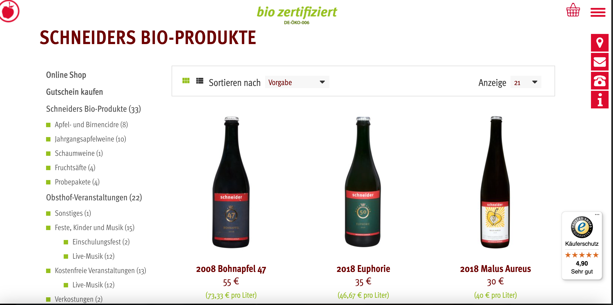
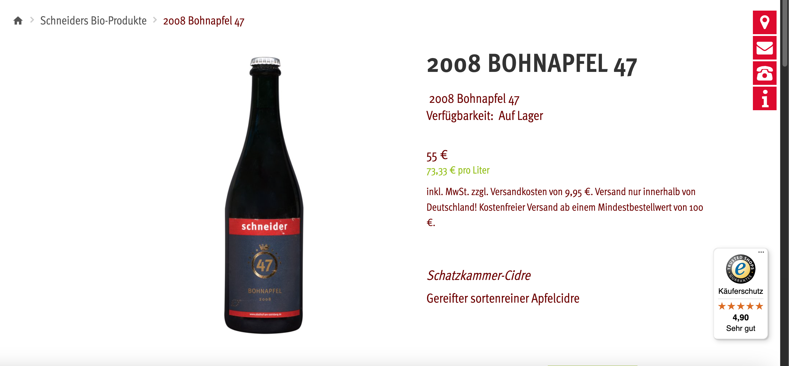
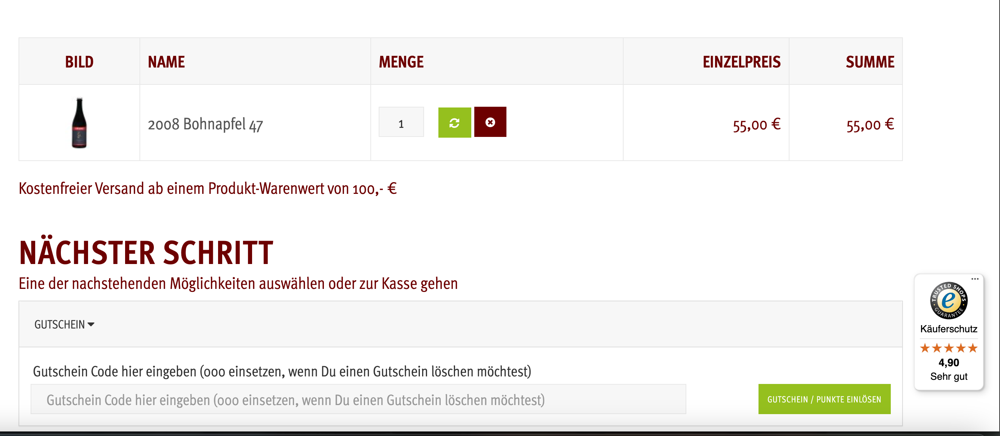
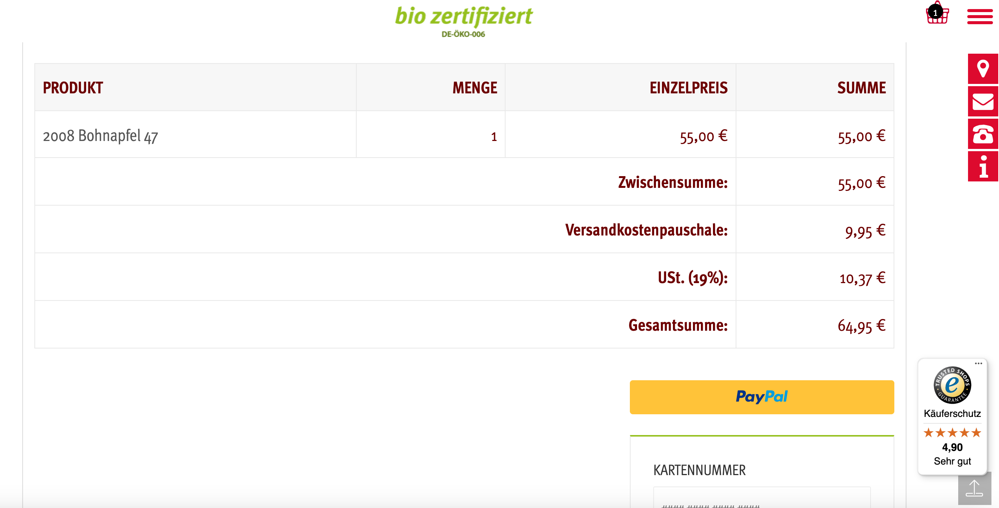
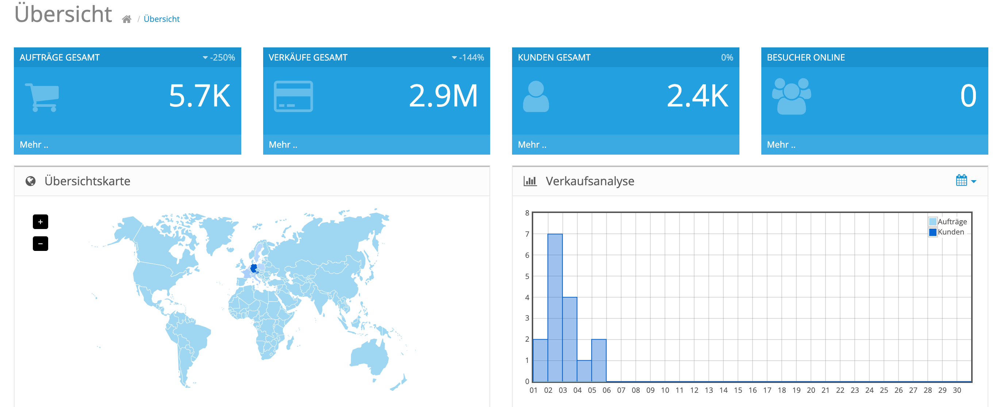

# Obsthof am Steinberg - OpenCart E-commerce Website

Welcome to the official GitHub repository for **Obsthof am Steinberg**, an e-commerce platform built with [OpenCart](https://www.opencart.com/). This website enables customers to explore and order fresh, locally grown fruits and related products online.

🌐 Live Site: [obsthof-am-steinberg.de](https://obsthof-am-steinberg.de/)

---

## 🛍️ Features

- Fully functional OpenCart storefront
- Custom product categories for seasonal fruits and regional goods
- Multi-language and multi-currency support
- SEO-optimized URLs and metadata
- Responsive design for mobile and desktop
- Customer registration, login, and profile management
- Secure checkout with multiple payment options
- Newsletter and contact form integration
- CMS for managing pages and content

---

## 📦 Tech Stack

- **CMS**: OpenCart (PHP-based)
- **Backend**: PHP, MySQL
- **Frontend**: HTML5, CSS3, JavaScript, Bootstrap
- **Server**: Apache / Nginx
- **Hosting**: Likely a Linux-based web server (e.g., shared/VPS)

---

📸 Screenshots
| Page | Description |
|------|-------------|
|  | **Homepage**: Modern, responsive homepage showcasing featured categories, offers, and custom-designed wall decals. |
|  | **Category Page**: Clean grid layout with filters for size, color, theme, and more. Users can easily find the right product. |
|  | **Product Page**: Detailed view with high-resolution images, live color preview, size options, and related products. |
|  | **Shopping Cart**: Simple and intuitive cart system with editable quantities, shipping estimator, and coupon support. |
|  | **Checkout Page**: Guest or registered checkout with secure payment integration (PayPal, Klarna, etc.). |
|  | **Admin Panel**: Clean and powerful admin interface to manage orders, products, customers, and SEO settings. |

## 🚀 Getting Started

### Prerequisites

- PHP >= 7.4
- MySQL/MariaDB
- Apache/Nginx with mod_rewrite enabled
- Composer (optional for dependency management)

### Installation Steps

1. **Clone the Repository**
   ```bash
   git clone https://github.com/your-username/obsthof-am-steinberg-opencart.git
   cd obsthof-am-steinberg-opencart
